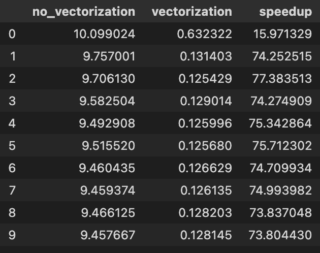
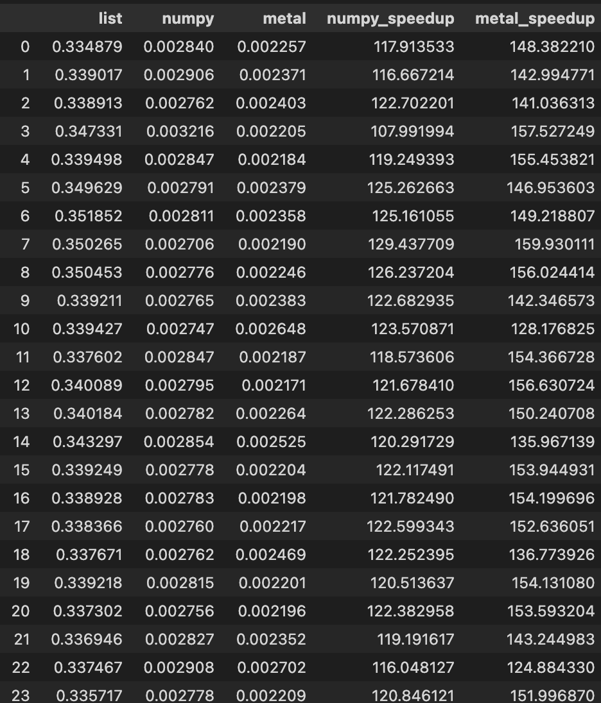

# Lecture 3 Exercise

<u> Note </u> I use Apple Silicon M2

## Exercise 1

I disigned to run process 10 times then use trimmean to compare and, for speedup, I used speedup each time to compute geometric mean
then the result is following.

[code](./exercise1.ipynb)

the result, 
1. trimmean of `no vectorization` : 9.5550 sec.
1. trimmean of `vectorization` : 0.1277 sec.
1. speedup mean : 64.1876 times

## Exercise 2

I designed to compare performance between **normal list, numpy and torch with metal**. I run each approach 51 times then use trimmean to compare and, for speedup, I used speedup each time to compute geometric mean
then the result is following.

example first 24 times

[code](./exercise2.ipynb)

the result,
1. trimmean of **normal list** : 0.3402 sec.
1. trimmean of **numpy** : 0.0028 sec.
1. trimmean of **metal torch** : 0.0023 sec.
1. **numpy** speedup : 121.7043 times
1. **metal** speedup : 148.4287 times

## Exercise 3

In my opinion, I think the situation that vectorization will be bad is the program that compute intensely but work on small data **bs.** we need time to move data to from CPU to GPU memery and the data is too small fill the warp fully so the computation will lose time for overhead more than computing.

Another situation is software may update lately to support new hardware bs. there is no general language that compatible with many hardware e.g. CUDA and OpenCL that support different hardware and not able to cross compile to another.